# Assignment 1: Automated Instance Management Using AWS Lambda and Boto3

## Objective

The goal of this assignment is to automate the starting and stopping of
EC2 instances based on tags using AWS Lambda and Boto3.

------------------------------------------------------------------------

# Architecture

EC2 Instances (Tagged)\
⬇\
AWS Lambda (Python + Boto3)\
⬇\
Automatic Start / Stop

------------------------------------------------------------------------

# Step 1: Create EC2 Instances

1.  Go to AWS Console → EC2 Dashboard
2.  Launch two instances (t2.micro).

### Instance 1

Name: `instance-stop`

Tag:

  Key      Value
  -------- -----------
  Action   Auto-Stop

Screenshot: EC2 instance with Auto-Stop tag

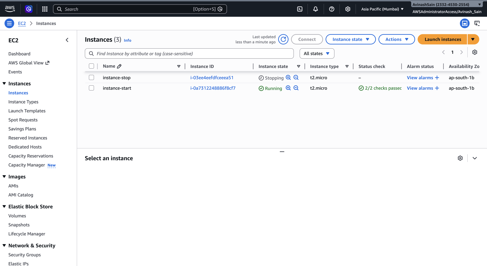

------------------------------------------------------------------------

### Instance 2

Name: `instance-start`

Tag:

  Key      Value
  -------- ------------
  Action   Auto-Start

Screenshot: EC2 instance with Auto-Start tag

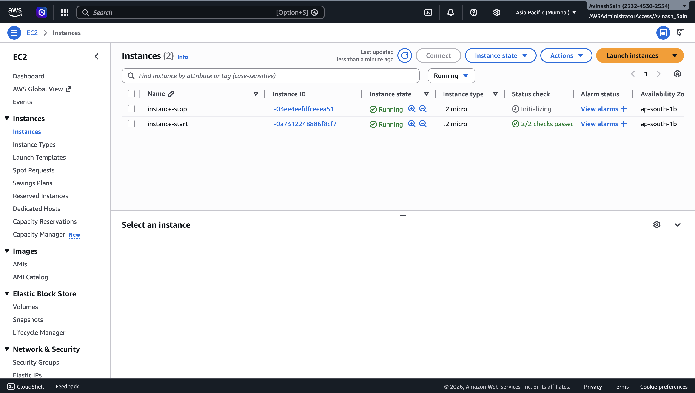

------------------------------------------------------------------------

# Step 2: Create IAM Role for Lambda

1.  Go to IAM Dashboard
2.  Click Roles → Create Role
3.  Choose Lambda
4.  Attach policy:

AmazonEC2FullAccess

Role Name:

LambdaEC2ManagerRole

Screenshot: IAM role with EC2 permissions

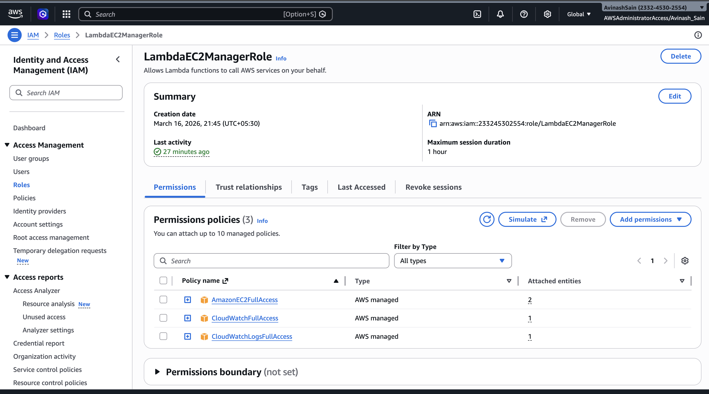

------------------------------------------------------------------------

# Step 3: Create Lambda Function

1.  Open AWS Lambda Console
2.  Click Create Function
3.  Choose Author From Scratch

Settings:

Function Name: ec2-auto-manager\
Runtime: Python 3.x\
Execution Role: LambdaEC2ManagerRole

Screenshot: Lambda function creation page

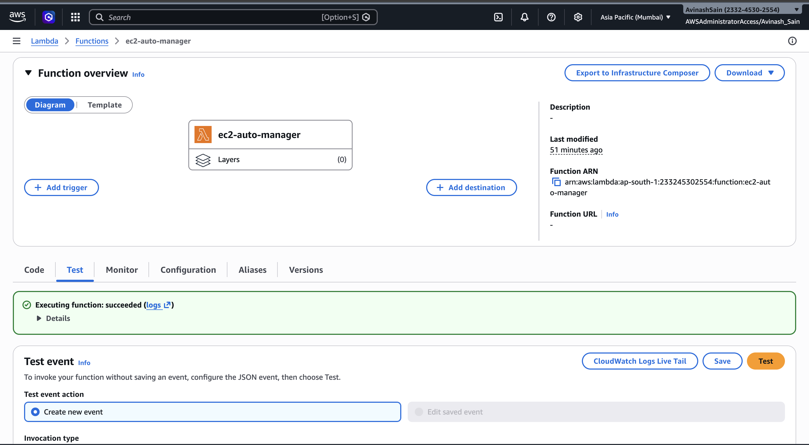

------------------------------------------------------------------------

# Step 4: Lambda Function Code

``` python
import boto3

ec2 = boto3.client('ec2')

def lambda_handler(event, context):

    # Stop instances with Auto-Stop tag
    stop_instances = ec2.describe_instances(
        Filters=[
            {'Name': 'tag:Action', 'Values': ['Auto-Stop']},
            {'Name': 'instance-state-name', 'Values': ['running']}
        ]
    )

    stop_ids = []

    for reservation in stop_instances['Reservations']:
        for instance in reservation['Instances']:
            stop_ids.append(instance['InstanceId'])

    if stop_ids:
        ec2.stop_instances(InstanceIds=stop_ids)
        print("Stopping instances:", stop_ids)
    else:
        print("No instances to stop")

    # Start instances with Auto-Start tag
    start_instances = ec2.describe_instances(
        Filters=[
            {'Name': 'tag:Action', 'Values': ['Auto-Start']},
            {'Name': 'instance-state-name', 'Values': ['stopped']}
        ]
    )

    start_ids = []

    for reservation in start_instances['Reservations']:
        for instance in reservation['Instances']:
            start_ids.append(instance['InstanceId'])

    if start_ids:
        ec2.start_instances(InstanceIds=start_ids)
        print("Starting instances:", start_ids)
    else:
        print("No instances to start")

    return {
        'statusCode': 200,
        'body': 'EC2 actions completed'
    }
```

Screenshot: Lambda code editor

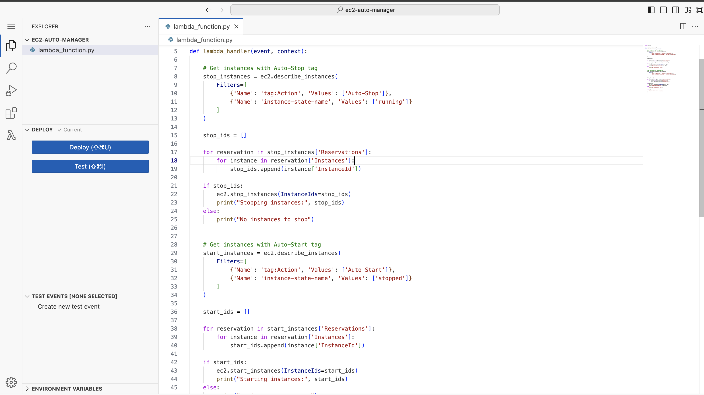

------------------------------------------------------------------------

# Step 5: Deploy and Test Lambda

1.  Click Deploy
2.  Click Test
3.  Create test event

Event Name: test

Screenshot: Lambda test execution

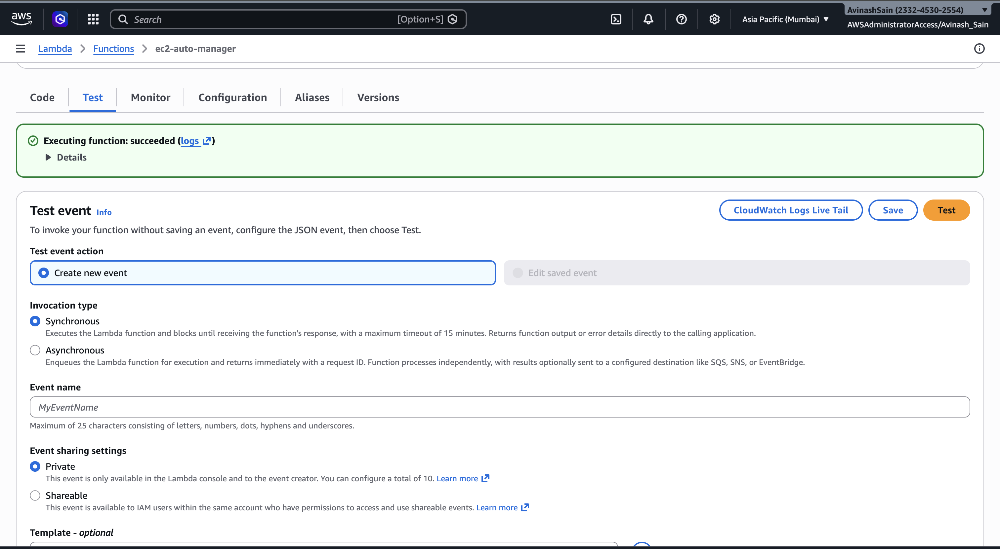

------------------------------------------------------------------------

# Step 6: Verify EC2 Results

Go back to EC2 Dashboard and check instance states.

Expected results:

  Instance         Tag          Result
  ---------------- ------------ ---------
  instance-stop    Auto-Stop    Stopped
  instance-start   Auto-Start   Running

Screenshot: EC2 instances state after Lambda execution

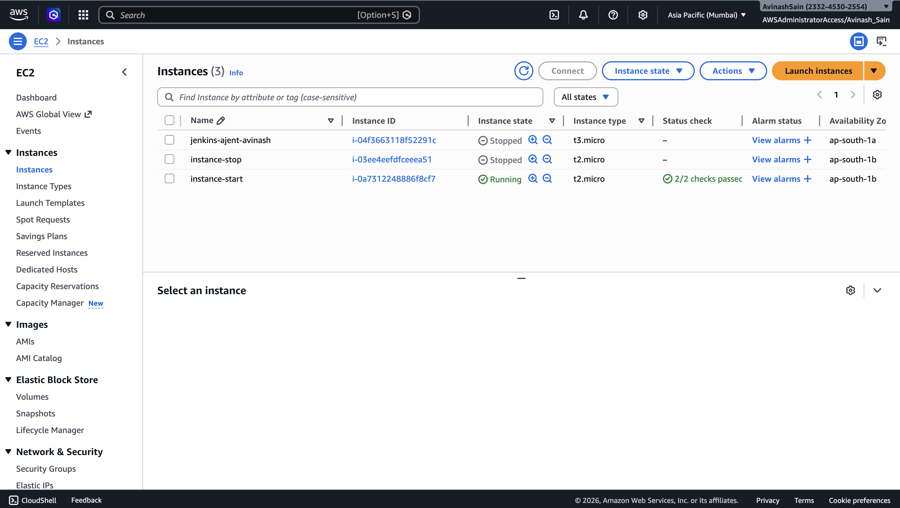

------------------------------------------------------------------------

# Case Testing

## Case 1

Initial state:

instance-stop = Stopped\
instance-start = Stopped

Result:

instance-stop = Stopped\
instance-start = Running

------------------------------------------------------------------------

## Case 2

Initial state:

instance-stop = Running\
instance-start = Running

Result:

instance-stop = Stopped\
instance-start = Running

------------------------------------------------------------------------

# Conclusion

This project demonstrates how AWS Lambda and Boto3 can automatically
manage EC2 instances based on tags.

This approach helps automate infrastructure management and reduce manual
work in cloud environments.

------------------------------------------------------------------------
# Assignment 2: Automated S3 Bucket Cleanup Using AWS Lambda and Boto3

## Objective

Automate deletion of files older than **30 days** from an S3 bucket
using AWS Lambda and Boto3.

------------------------------------------------------------------------

# Architecture

S3 Bucket (Files Stored) ↓ AWS Lambda (Python + Boto3) ↓ Delete Files
Older Than 30 Days

------------------------------------------------------------------------

# Step 1: Create S3 Bucket

1.  Go to **AWS Console → S3**
2.  Click **Create Bucket**
3.  Example bucket name:

s3-cleanup-demo-avinash

4.  Upload multiple files.

Ensure: - Some files are **older than 30 days** - Some files are
**recent**

Screenshot

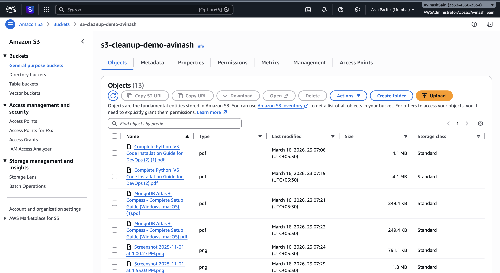

------------------------------------------------------------------------

# Step 2: Create IAM Role for Lambda

1.  Open **IAM → Roles**
2.  Click **Create Role**
3.  Select **Lambda**
4.  Attach policy:

AmazonS3FullAccess

5.  Role Name:

LambdaS3CleanupRole

Screenshot

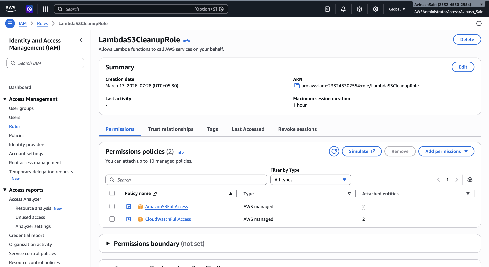

------------------------------------------------------------------------

# Step 3: Create Lambda Function

Configuration:

Function Name: s3-cleanup-function\
Runtime: Python 3.x\
Execution Role: LambdaS3CleanupRole

Screenshot

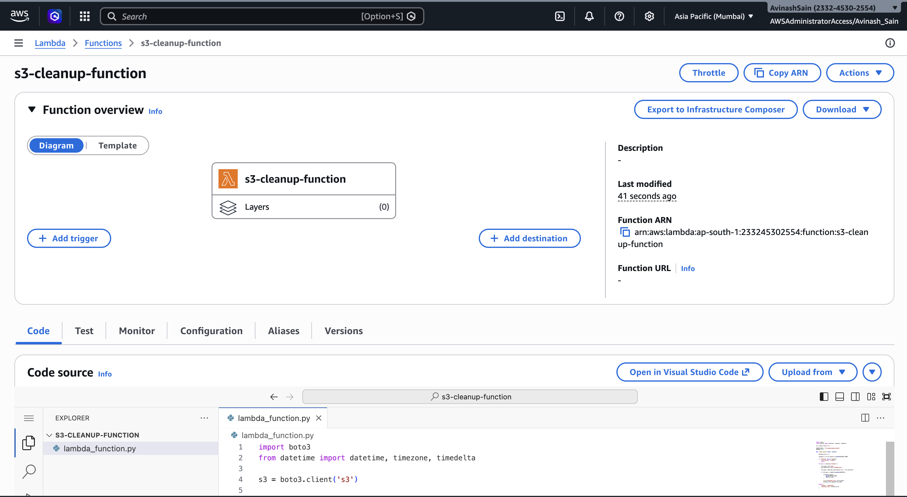

------------------------------------------------------------------------

# Step 4: Lambda Code

``` python
import boto3
from datetime import datetime, timezone, timedelta

s3 = boto3.client('s3')

BUCKET_NAME = "s3-cleanup-demo-avinash"
DAYS = 30

def lambda_handler(event, context):

    deleted_files = []

    response = s3.list_objects_v2(Bucket=BUCKET_NAME)

    if 'Contents' not in response:
        print("Bucket is empty")
        return

    for obj in response['Contents']:

        file_name = obj['Key']
        last_modified = obj['LastModified']

        file_age = datetime.now(timezone.utc) - last_modified

        if file_age > timedelta(days=DAYS):

            s3.delete_object(
                Bucket=BUCKET_NAME,
                Key=file_name
            )

            deleted_files.append(file_name)
            print(f"Deleted: {file_name}")

    if not deleted_files:
        print("No old files found")

    return {
        'statusCode': 200,
        'deleted_files': deleted_files
    }
```

Screenshot

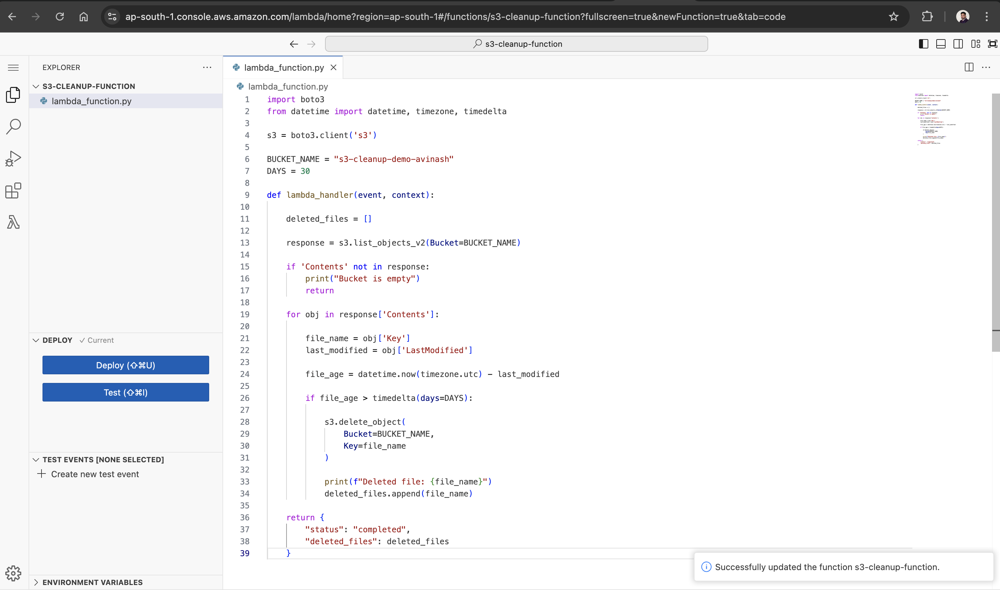

------------------------------------------------------------------------

# Step 5: Test Lambda

1.  Click **Deploy**
2.  Click **Test**
3.  Create test event

Event Name: test

Screenshot

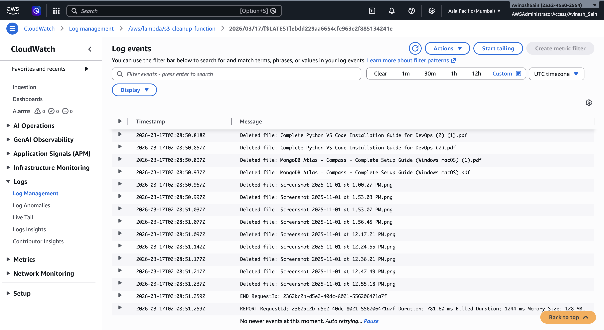

------------------------------------------------------------------------

# Step 6: Verify Results

After running Lambda:

  File Age             Result
  -------------------- ---------
  Older than 30 days   Deleted
  Newer than 30 days   Remains

Screenshot

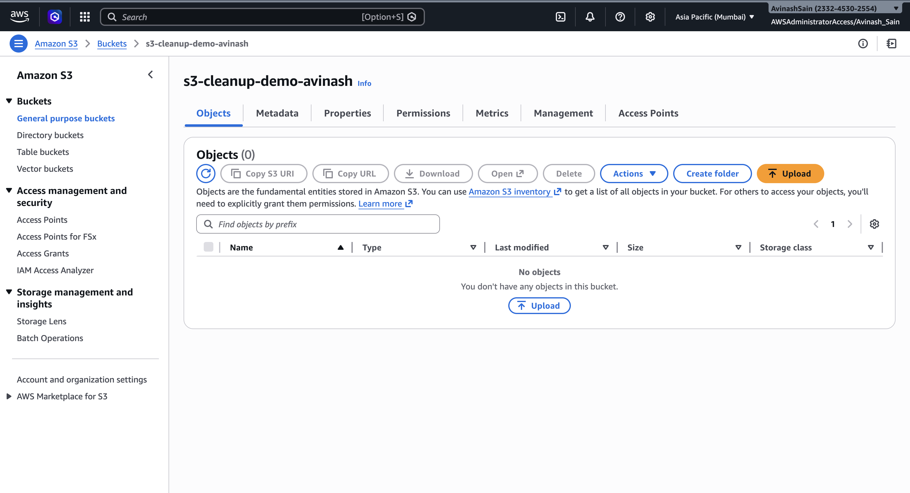

------------------------------------------------------------------------

# Example Logs

Deleted file: Complete Python VS Code Installation Guide for DevOps (2) (1).pdf
Deleted file: Complete Python VS Code Installation Guide for DevOps (2).pdf
Deleted file: MongoDB Atlas + Compass - Complete Setup Guide (Windows macOS) (1).pdf
Deleted file: MongoDB Atlas + Compass - Complete Setup Guide (Windows macOS).pdf
Deleted file: Screenshot 2025-11-01 at 1.00.27 PM.png
Deleted file: Screenshot 2025-11-01 at 1.53.03 PM.png
Deleted file: Screenshot 2025-11-01 at 1.53.07 PM.png
Deleted file: Screenshot 2025-11-01 at 1.56.45 PM.png
Deleted file: Screenshot 2025-11-01 at 12.17.21 PM.png
Deleted file: Screenshot 2025-11-01 at 12.24.55 PM.png
Deleted file: Screenshot 2025-11-01 at 12.36.01 PM.png
Deleted file: Screenshot 2025-11-01 at 12.47.49 PM.png
Deleted file: Screenshot 2025-11-01 at 12.55.18 PM.png

------------------------------------------------------------------------

# Assignment 4: Automatic EBS Snapshot and Cleanup Using AWS Lambda

---

## Objective
Automate EBS snapshot creation and delete snapshots older than 30 days using AWS Lambda and Boto3.

---

## Project Structure
```
assignment-ebs-snapshot/
│
├── README.md
├── lambda_function.py
├── screenshots/
│   ├── 1-ebs-volume.png
│   ├── 2-iam-role.png
│   ├── 3-lambda-function.png
│   ├── 4-lambda-code.png
│   ├── 5-test-output.png
│   ├── 6-eventbridge-rule.png
│   ├── 7-eventbridge-rule.png
│   ├── 8-cloudwatch-logs.png
│   └── 9-ec2-snapshots.png
```

---

## Step 1: EBS Volume Setup
- Created an EBS volume from EC2 dashboard
- Volume ID: `vol-xxxxxxxx`

Screenshot:
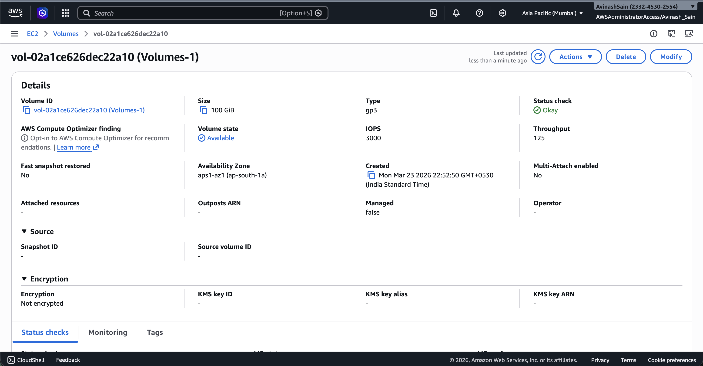

---

## Step 2: IAM Role
- Created IAM Role for Lambda
- Attached policy: `AmazonEC2FullAccess, CloudWatchFullAccess`

Screenshot:
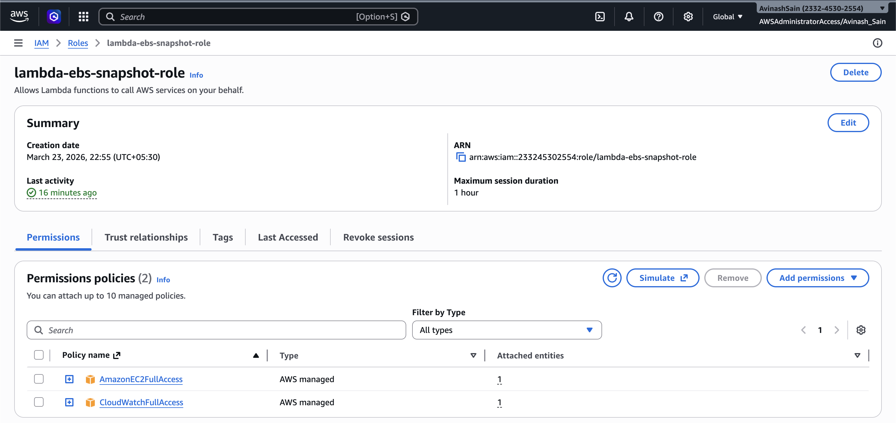

---

## Step 3: Lambda Function Setup
- Function Name: `ebs-snapshot-cleanup-function`
- Runtime: Python 3.x

Screenshot:
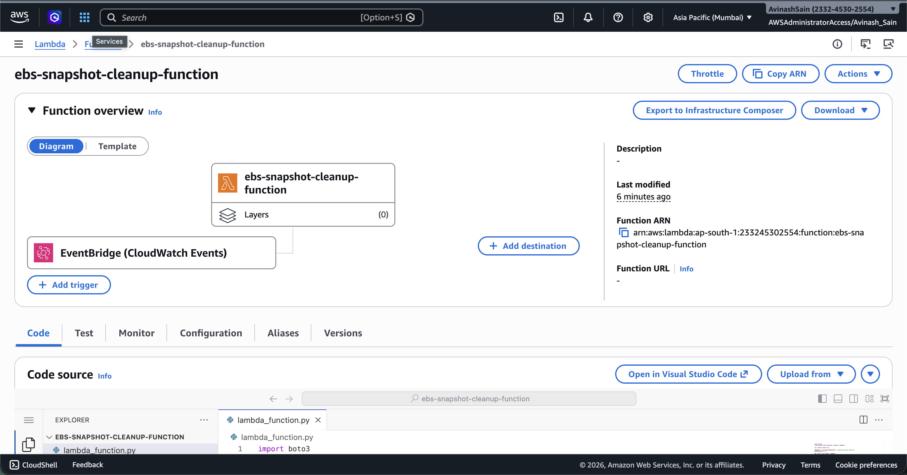

---

## Step 4: Lambda Code

```python
import boto3
from datetime import datetime, timezone, timedelta

ec2 = boto3.client('ec2')

VOLUME_ID = "vol-xxxxxxxx"  # replace with your volume id
RETENTION_DAYS = 30

def lambda_handler(event, context):
    description = f"Automated snapshot for {VOLUME_ID} on {datetime.now(timezone.utc)}"
    
    snapshot = ec2.create_snapshot(
        VolumeId=VOLUME_ID,
        Description=description
    )
    
    snapshot_id = snapshot['SnapshotId']
    print(f"Created Snapshot: {snapshot_id}")
    
    snapshots = ec2.describe_snapshots(
        Filters=[{'Name': 'volume-id', 'Values': [VOLUME_ID]}],
        OwnerIds=['self']
    )
    
    deleted_snapshots = []
    now = datetime.now(timezone.utc)
    
    for snap in snapshots['Snapshots']:
        start_time = snap['StartTime']
        age = now - start_time
        
        if age > timedelta(days=RETENTION_DAYS):
            ec2.delete_snapshot(SnapshotId=snap['SnapshotId'])
            deleted_snapshots.append(snap['SnapshotId'])
    
    print(f"Deleted Snapshots: {deleted_snapshots}")
    
    return {
        "created_snapshot": snapshot_id,
        "deleted_snapshots": deleted_snapshots
    }
```

---

Screenshot:
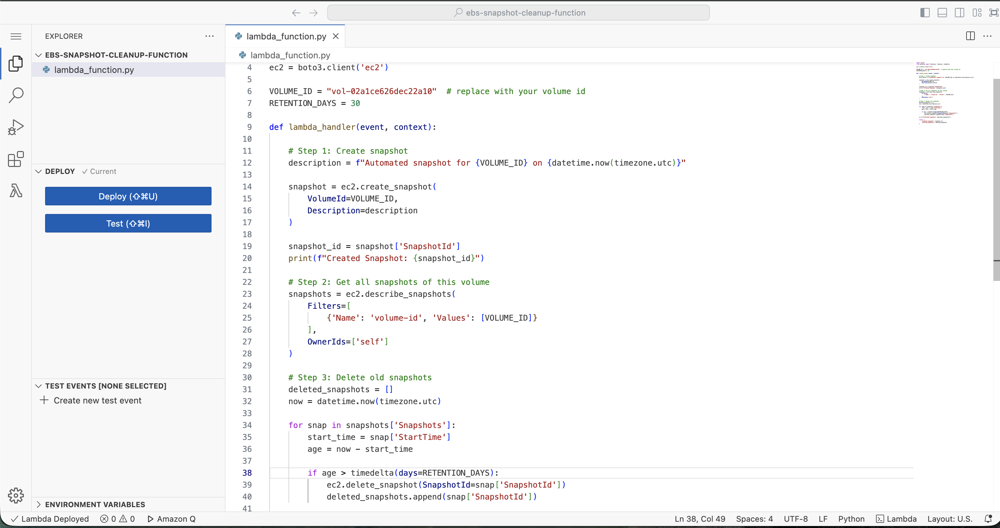

## Step 5: Testing (Important)

### Temporary Changes for Testing:
To verify snapshot deletion quickly, the following changes were made:

```python
RETENTION_DAYS = 0
```

OR

```python
if age > timedelta(minutes=2):
```

### EventBridge Schedule for Testing:
```
rate(5 minutes)
```

### Result:
- Snapshot created automatically
- Snapshot deleted within 2 minutes

Screenshot:
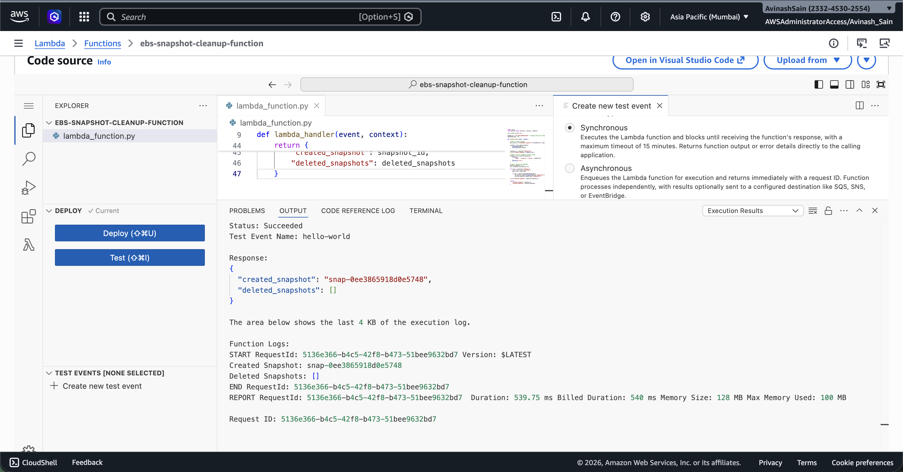

---

## Step 6: EventBridge Trigger (Final Setup)
- Created rule using schedule:
```
rate(7 days)
```

Screenshot (Event Schedule):
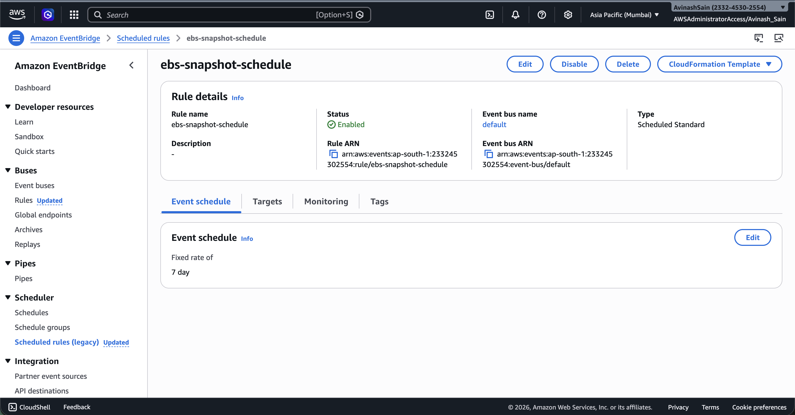

Screenshot (Targets):
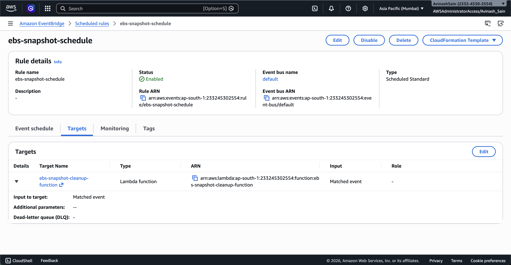

---

## Step 7: CloudWatch Logs
- Verified logs for execution

Screenshot:
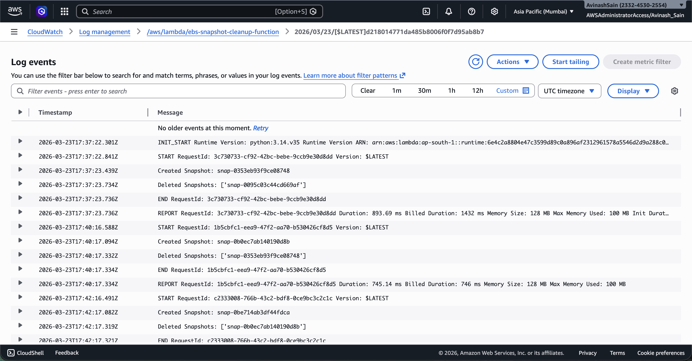

---

## Step 8: Snapshot Verification
- Checked EC2 → Snapshots
- Confirmed:
  - New snapshot created
  - Old snapshots deleted

Screenshot:
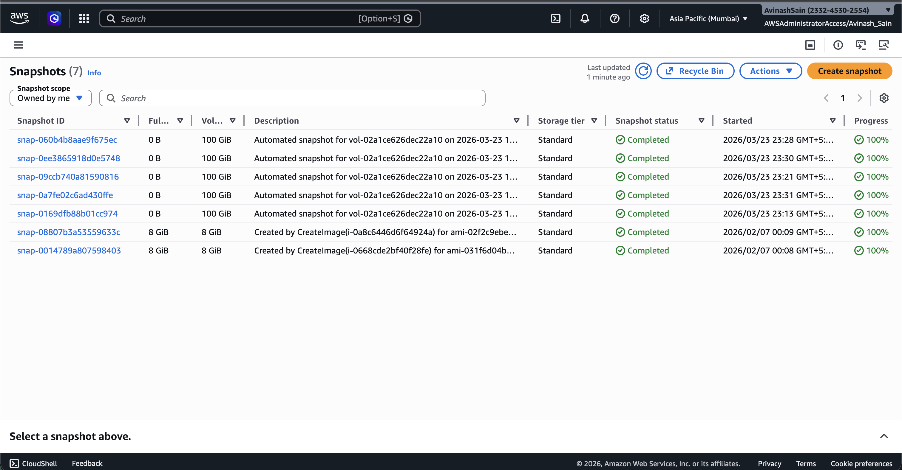

---

## Output Example
```
Created Snapshot: snap-abc
Deleted Snapshots: ['snap-xyz']
```

---

## Conclusion
This project successfully automates:
- EBS snapshot creation
- Cleanup of old snapshots
- Scheduled execution using EventBridge

This reduces manual effort and optimizes storage cost.

---

## Improvements
- Use tags to filter snapshots
- Add SNS notifications
- Implement least privilege IAM role

---

## Note
After testing, ensure:
- `RETENTION_DAYS = 30`
- Schedule is set to `rate(7 days)`

------------------------------------------------------------------------

# Assignment 5: Auto-Tagging EC2 Instances on Launch Using AWS Lambda and Boto3

## Objective

Automatically tag EC2 instances at launch using AWS Lambda.

------------------------------------------------------------------------

# Architecture

EC2 Launch → EventBridge → Lambda → Auto Tagging

------------------------------------------------------------------------

# Step 1: EC2 Setup

Go to AWS EC2 dashboard.

Screenshot 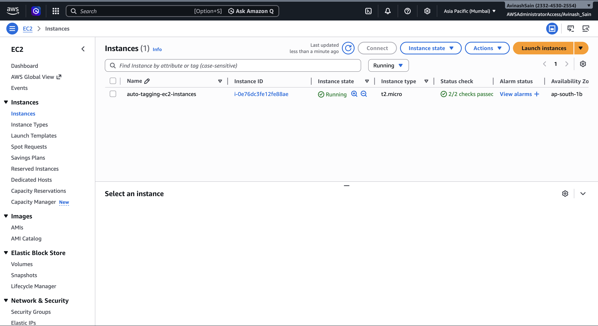

------------------------------------------------------------------------

# Step 2: IAM Role

Policy: AmazonEC2FullAccess

Role Name: LambdaEC2AutoTagRole

Screenshot 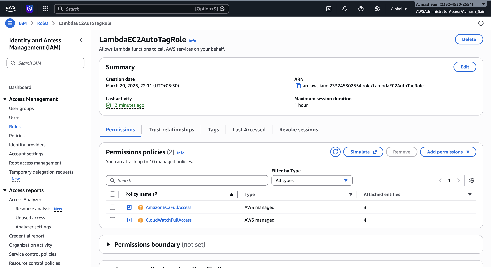

------------------------------------------------------------------------

# Step 3: Lambda Function

Function Name: auto-tagging-function\
Runtime: Python 3.x

Screenshot 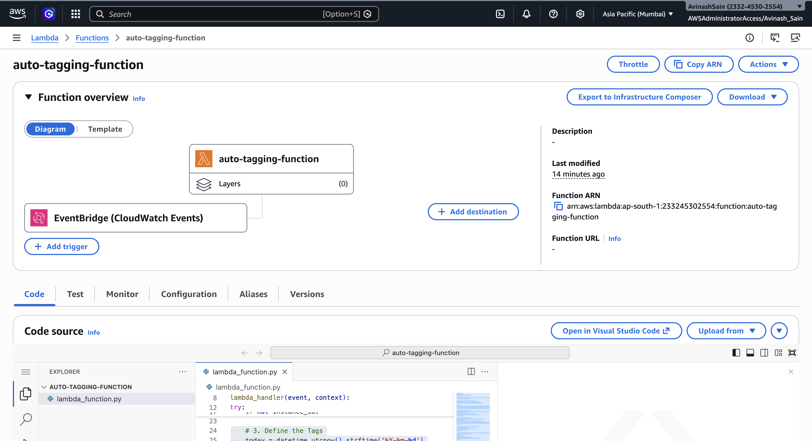

------------------------------------------------------------------------

# Step 4: Code

``` python
import boto3
import json
from datetime import datetime

# Initialize the EC2 client outside the handler for better performance (TCP Warm Start)
ec2 = boto3.client('ec2')

def lambda_handler(event, context):
    # 1. Log the incoming event for debugging
    print("Received event:", json.dumps(event))

    try:
        # 2. Extract Instance ID from the EventBridge structure
        # Matches the 'EC2 Instance State-change Notification' format
        instance_id = event.get('detail', {}).get('instance-id')

        if not instance_id:
            print("No Instance ID found in event. Exiting.")
            return {
                'statusCode': 400,
                'body': 'Missing instance-id'
            }

        # 3. Define the Tags
        today = datetime.utcnow().strftime('%Y-%m-%d')
        tags = [
            {'Key': 'LaunchDate', 'Value': today},
            {'Key': 'HeroVired', 'Value': 'DevOps-Avinash'},
            {'Key': 'ManagedBy', 'Value': 'Lambda-Automation'}
        ]

        # 4. Apply Tags to the EC2 Instance
        ec2.create_tags(
            Resources=[instance_id],
            Tags=tags
        )

        success_msg = f"Successfully tagged instance {instance_id}"
        print(success_msg)
        
        return {
            'statusCode': 200,
            'body': json.dumps(success_msg)
        }

    except Exception as e:
        print(f"Error: {str(e)}")
        return {
            'statusCode': 500,
            'body': json.dumps(f"Internal Error: {str(e)}")
        }
```

Screenshot 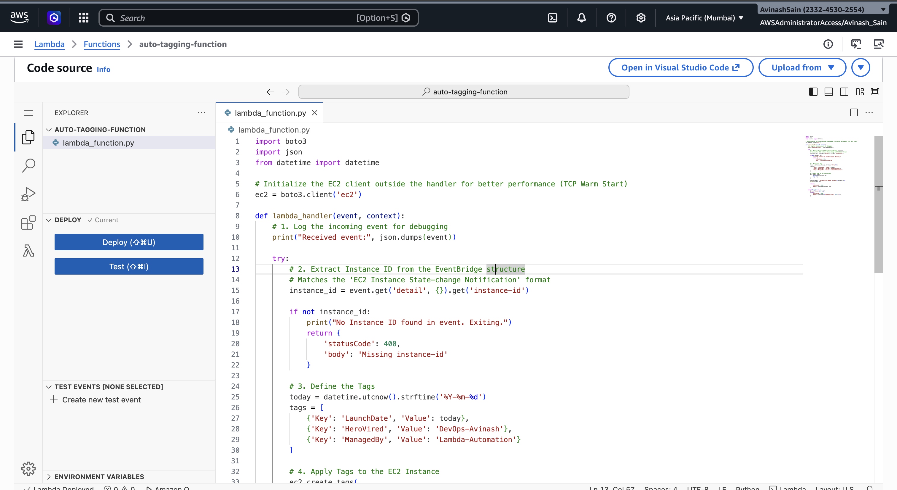

------------------------------------------------------------------------

# Step 5: EventBridge Rule

Event: EC2 → State change → running

Screenshot 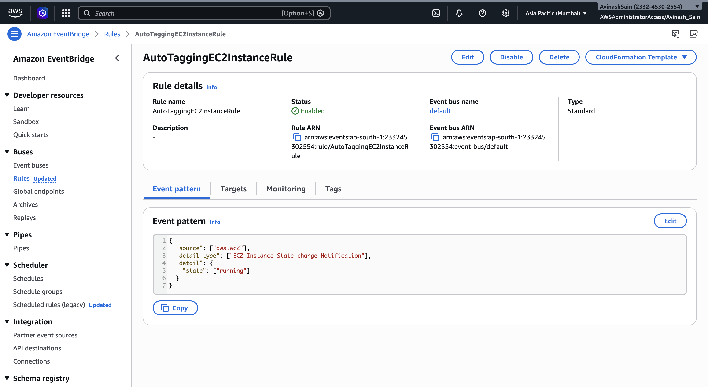

------------------------------------------------------------------------

# Step 6: Add Target

Lambda: ec2-auto-tag

Screenshot 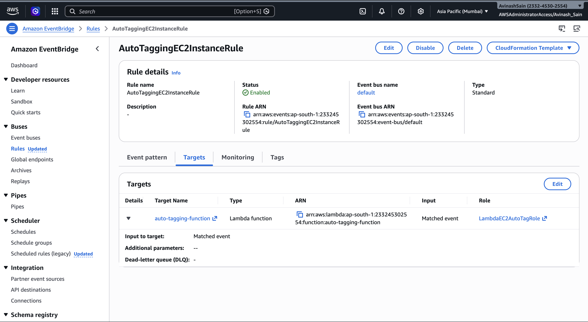

------------------------------------------------------------------------

# Step 7: Test

Launch EC2 instance

Screenshot 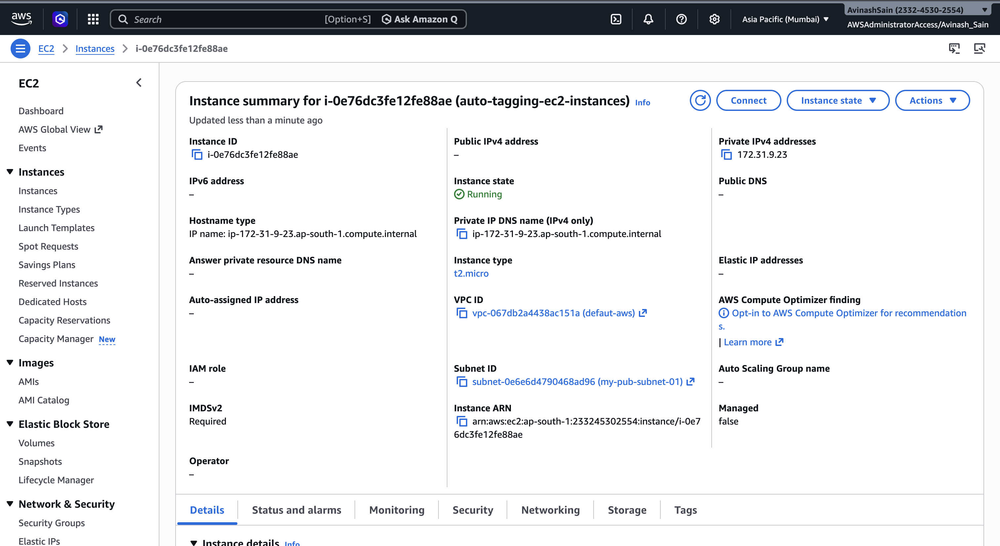

------------------------------------------------------------------------

# Step 8: Verify

Check Tags:

LaunchDate → Date\
HeroVired → DevOps-Avinash\
ManagedBy → Lambda-Automation

Screenshot 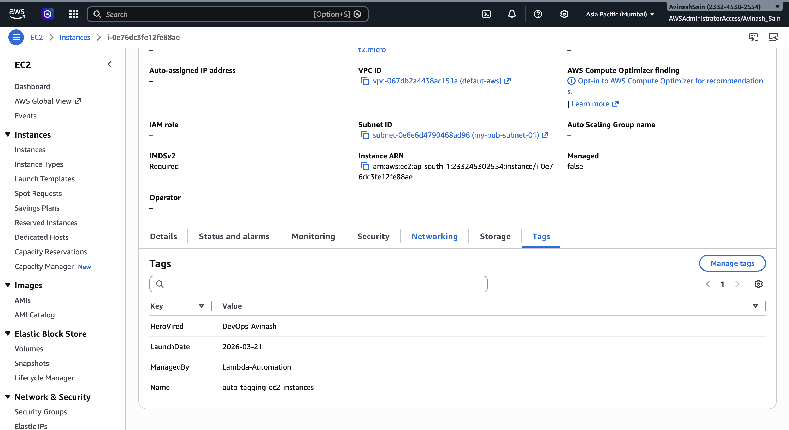

------------------------------------------------------------------------

# Step 9: CloudWatch Logs

1.  Go to Lambda → Monitor
2.  Click **View CloudWatch Logs**
3.  Open latest log stream

Expected Logs:

    START RequestId: xxxx
    Tagged instance i-1234567890
    END RequestId: xxxx
    REPORT RequestId: xxxx Duration: 120 ms

Screenshots

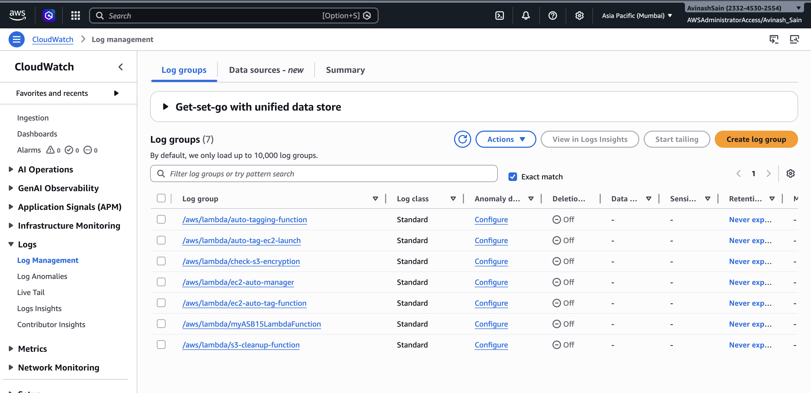\
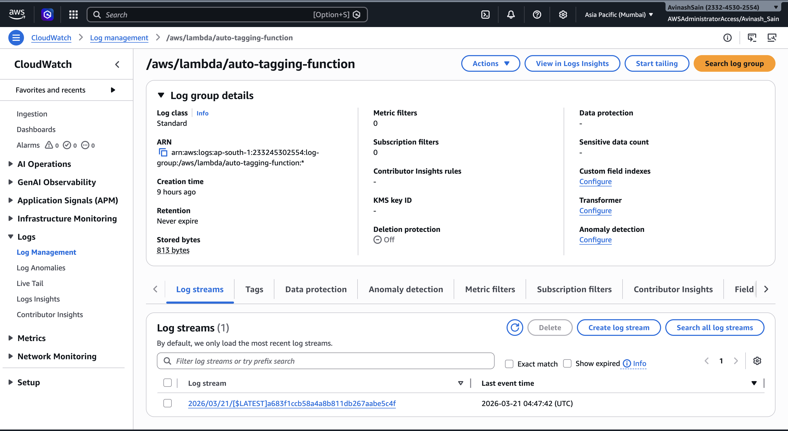\
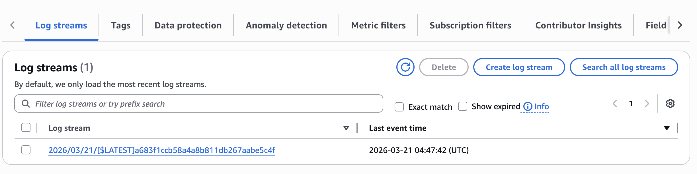\
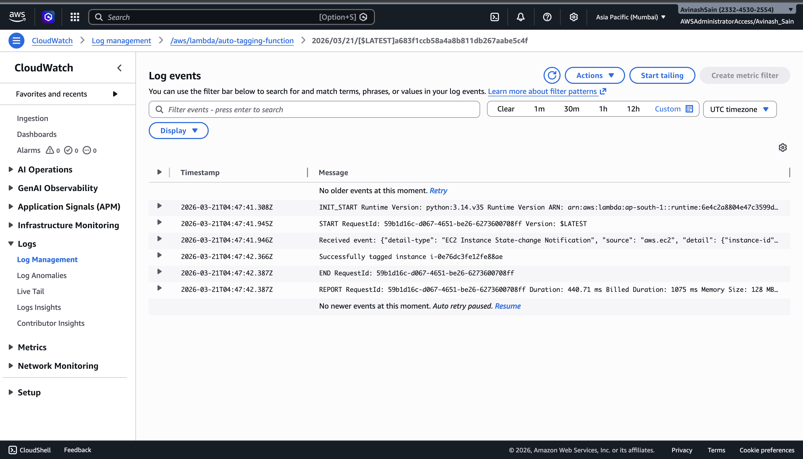

# Folder Structure

    aws-ec2-auto-tagging/
    ├── README.md
    ├──lambda_function.py
    └── screenshots/

------------------------------------------------------------------------

# Assignment 6: Monitor and Alert High AWS Billing Using AWS Lambda, Boto3, and SNS

## Objective

Create an automated alerting system that notifies you when AWS billing exceeds a defined threshold.

---

# Architecture

CloudWatch Billing Metrics
⬇
AWS Lambda (Python + Boto3)
⬇
SNS Topic (Email Alert)

---

# Step 1: SNS Setup

1. Go to **AWS Console → SNS**
2. Click **Create Topic**
3. Choose **Standard**
4. Name:

```
billing-alert-topic
```

5. Create Subscription:

   * Protocol: Email
   * Endpoint: your email

6. Confirm subscription from your email inbox

Screenshot
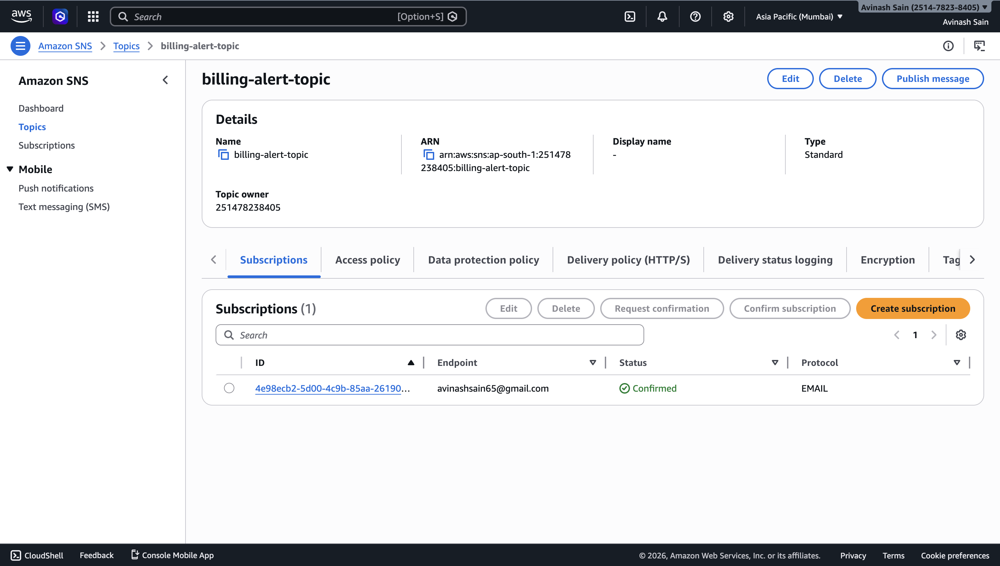

---

# Step 2: Create IAM Role for Lambda

1. Go to **IAM → Roles**
2. Click **Create Role**
3. Choose **Lambda**
4. Attach policies:

```
CloudWatchFullAccess
AmazonSNSFullAccess
```

5. Role name:

```
lambda-billing-role
```

Screenshot
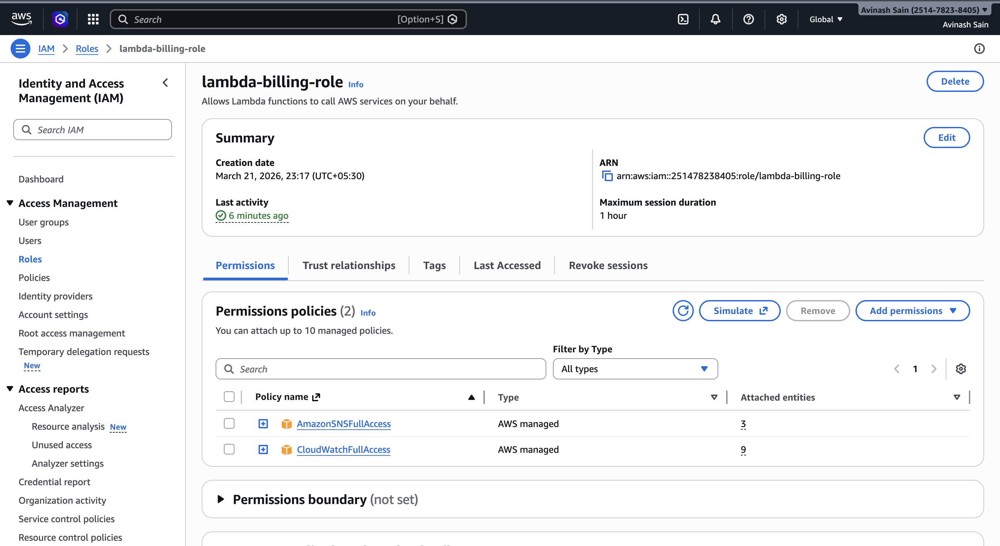

---

# Step 3: Create Lambda Function

1. Go to **AWS Lambda**
2. Click **Create Function**
3. Choose **Author from scratch**

Configuration:

```
Function Name: lambda-billing-function
Runtime: Python 3.x
Execution Role: lambda-billing-role
```

Screenshot
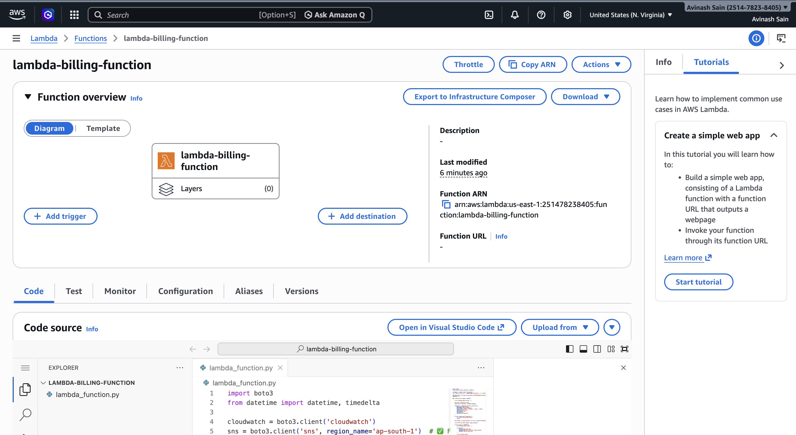

---

# Step 4: Lambda Function Code

```python
import boto3
from datetime import datetime, timedelta

cloudwatch = boto3.client('cloudwatch')
sns = boto3.client('sns')

SNS_TOPIC_ARN = "YOUR_SNS_TOPIC_ARN"
THRESHOLD = 50

def lambda_handler(event, context):

    end = datetime.utcnow()
    start = end - timedelta(days=1)

    response = cloudwatch.get_metric_statistics(
        Namespace='AWS/Billing',
        MetricName='EstimatedCharges',
        Dimensions=[
            {
                'Name': 'Currency',
                'Value': 'USD'
            }
        ],
        StartTime=start,
        EndTime=end,
        Period=86400,
        Statistics=['Maximum']
    )

    if response['Datapoints']:
        amount = response['Datapoints'][0]['Maximum']
        print(f"Current Billing: ${amount}")

        if amount > THRESHOLD:
            message = f"AWS Billing Alert! Current charges: ${amount}"

            sns.publish(
                TopicArn=SNS_TOPIC_ARN,
                Message=message,
                Subject="AWS Billing Alert"
            )

            print("Alert sent!")
        else:
            print("Billing under control")

    else:
        print("No billing data found")
```

Screenshot
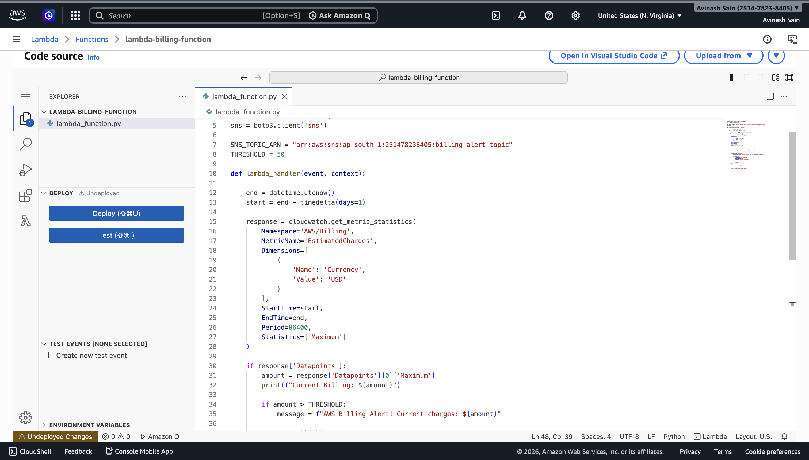

---

# Step 5: Create EventBridge Schedule (Bonus)

1. Go to **EventBridge**
2. Click **Create Rule**
3. Choose **Schedule**

Configuration:

```
Rate: 1 day
```

4. Target:

   * Lambda Function → `lambda-billing-function`

Screenshot
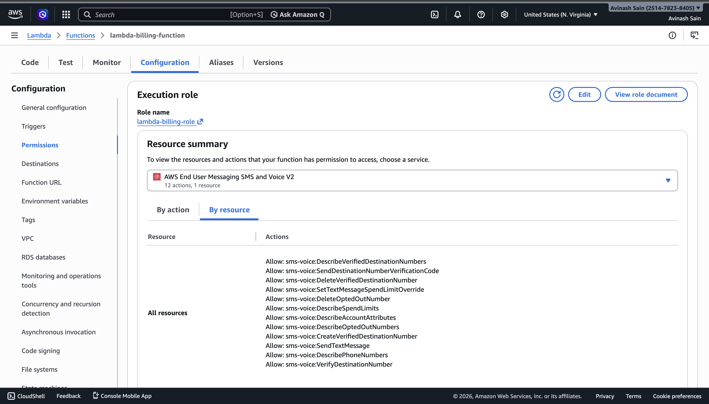

---

# Step 6: Test Lambda Function

1. Click **Deploy**
2. Click **Test**
3. Create test event:

```
Event Name: test
```

Screenshot
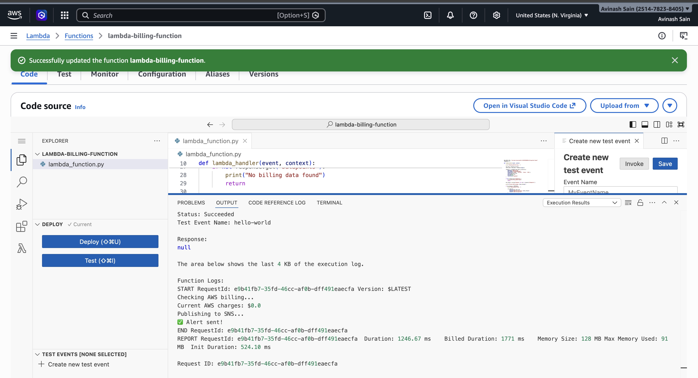

---

# Step 7: Verify Email Alert

If billing exceeds threshold:

* You will receive an email notification

Screenshot
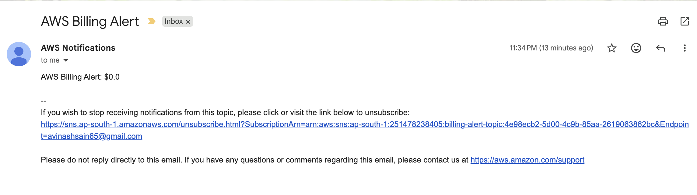

---

# Step 8: CloudWatch Logs

Go to:

**Lambda → Monitor → View CloudWatch Logs**

Expected output:

```
Current Billing: $0.0
Alert sent!
```

Screenshot
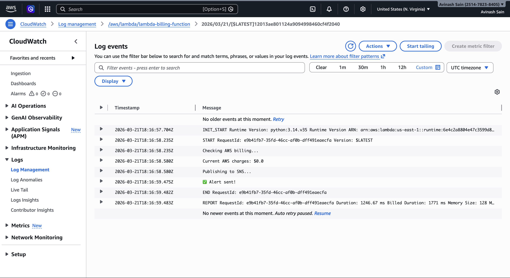

---

# Step 9: Testing Tip (Important)

For testing purposes, set:

THRESHOLD = 0

This ensures:

- Billing will always be greater than 0  
- SNS alert will always trigger  
- Easy verification of setup  

---

## Example Output

CloudWatch Logs:

Current Billing: $0.0 
Alert sent!

---

⚠️ After testing, change it back:

THRESHOLD = 50

Otherwise, you will receive alerts every day.

# Folder Structure

```
aws-billing-alert/
│
├── README.md
├──lambda_function.py
└── screenshots/
    ├── sns-topic.png
    ├── iam-role-billing.png
    ├── lambda-create.png
    ├── lambda-code-billing.png
    ├── event-rule-billing.png
    ├── lambda-test-billing.png
    ├── email-alert.png
    └── cloudwatch-logs-billing.png
```

---

# Expected Result

* Lambda runs daily
* Checks billing amount
* Sends alert if threshold exceeded
* Logs activity in CloudWatch

---

# Conclusion

This project demonstrates how to:

* Monitor AWS billing using CloudWatch
* Automate alerts using Lambda
* Notify users via SNS

---

# Future Improvements

* Add multiple alert thresholds
* Integrate with Slack or Teams
* Store billing data in S3
* Use cost anomaly detection

------------------------------------------------------------------------

# Assignment 7: DynamoDB Item Change Alert Using AWS Lambda, Boto3, and SNS

---

## Objective
Automate alerts whenever an item in a DynamoDB table is updated.

---

## Architecture
DynamoDB → DynamoDB Stream → Lambda → SNS → Email

---

## Steps

### 1. DynamoDB Setup
- Create table: `UserTable`
- Partition key: `userId`
- Add sample item

Screenshot:
- 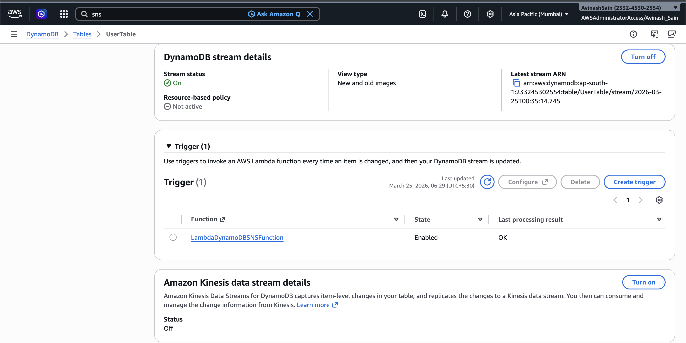
- 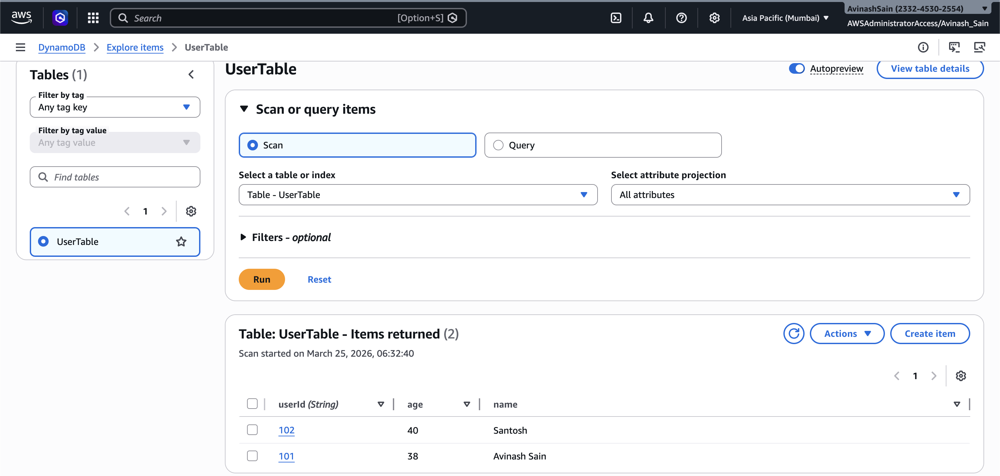

---

### 2. Enable DynamoDB Streams
- Enable stream
- Select: **New and old images**

Screenshot:
- 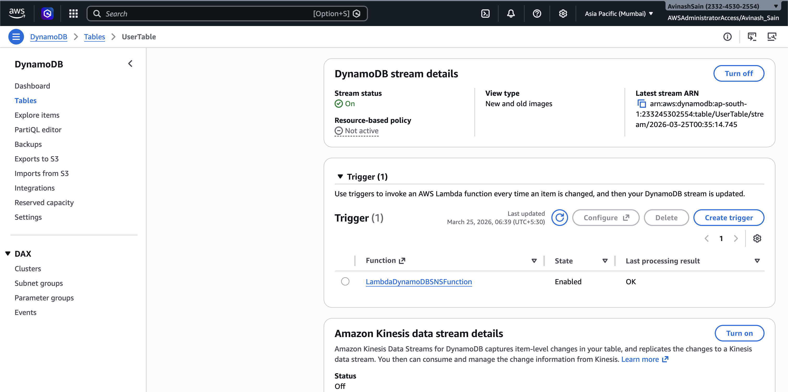

---

### 3. SNS Setup
- Create topic: `DynamoDB-Alerts`
- Subscribe email
- Confirm subscription

- Screenshot 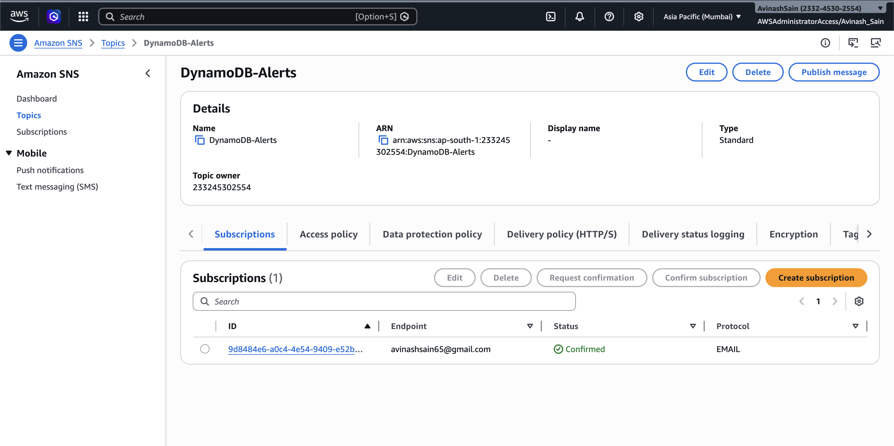
- Screenshot 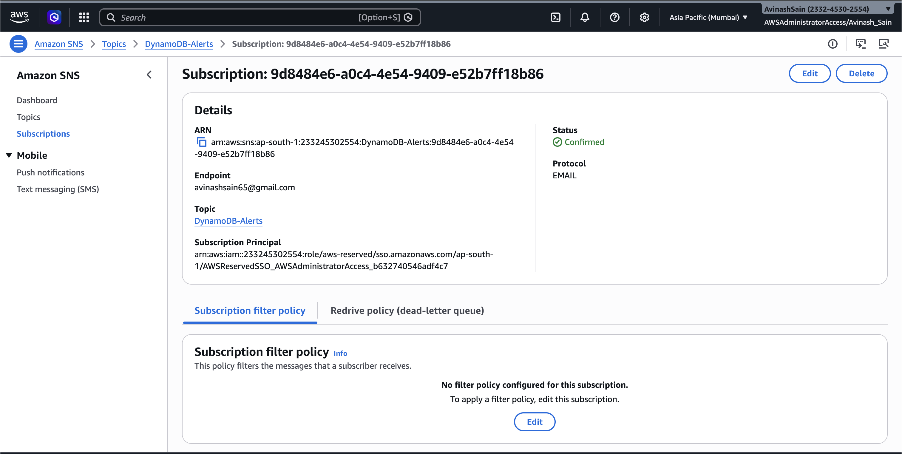

---

### 4. IAM Role
- Create role for Lambda
- Attach policies:
  - AmazonDynamoDBFullAccess
  - AmazonSNSFullAccess
  - CloudWatchFullAccess

- Screenshot 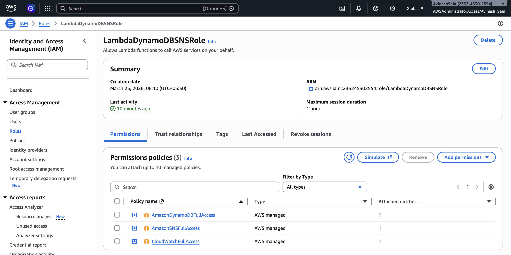

---

### 5. Lambda Function
- Runtime: Python 3.x
- Attach IAM role

```python
import json
import boto3

sns = boto3.client('sns')

SNS_TOPIC_ARN = "arn:aws:sns:ap-south-1:XXXXXXXXXXXX:DynamoDB-Alerts"

def lambda_handler(event, context):
    print("Event Received:", json.dumps(event))
    
    for record in event['Records']:
        if record['eventName'] == 'MODIFY':
            old_image = record['dynamodb'].get('OldImage', {})
            new_image = record['dynamodb'].get('NewImage', {})

            message = "DynamoDB Item Updated\n\n"
            message += "Old Value:\n" + json.dumps(old_image, indent=2)
            message += "\n\nNew Value:\n" + json.dumps(new_image, indent=2)

            sns.publish(
                TopicArn=SNS_TOPIC_ARN,
                Subject="DynamoDB Item Updated Alert",
                Message=message
            )

    return {
        'statusCode': 200,
        'body': 'Notification Sent'
    }
```

- Screenshot 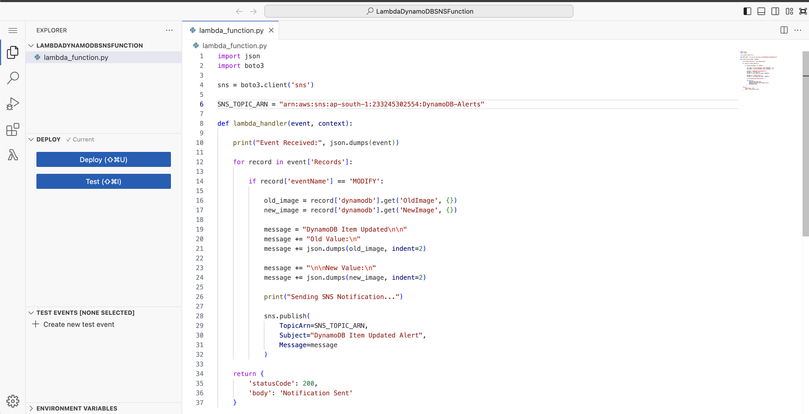

---

### 6. Add Trigger
- Add DynamoDB trigger to Lambda

- Screenshot 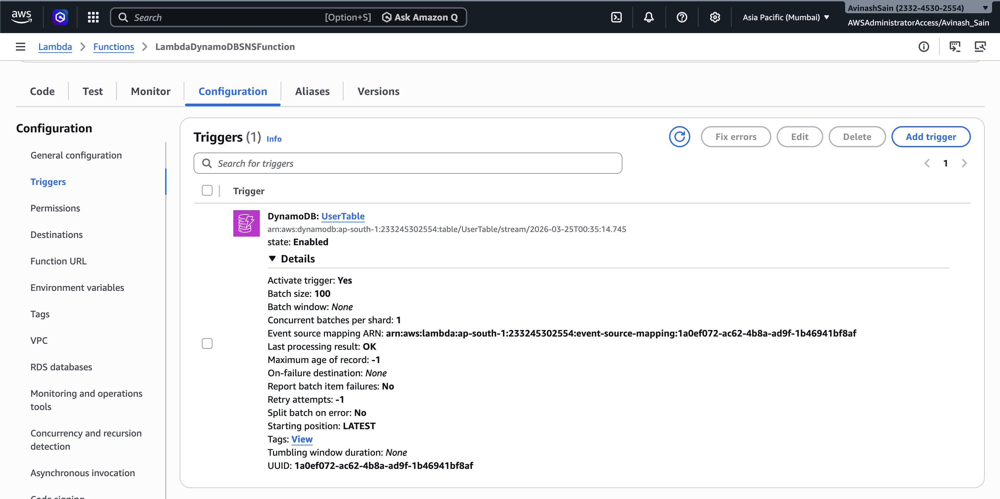

---

### 7. Testing
- Update item in DynamoDB

Example:
- age: 40 → 26

- Screenshot 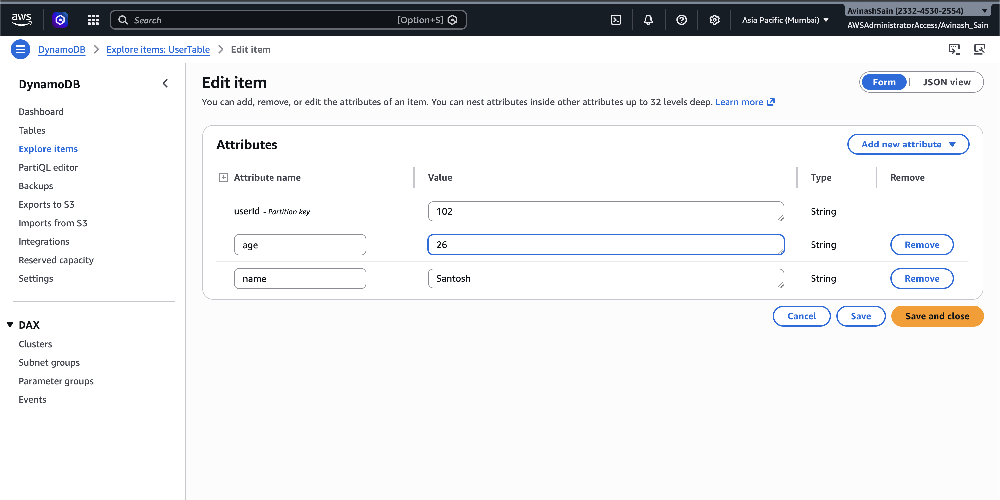

---

## Output

### Email Alert
- Screenshot 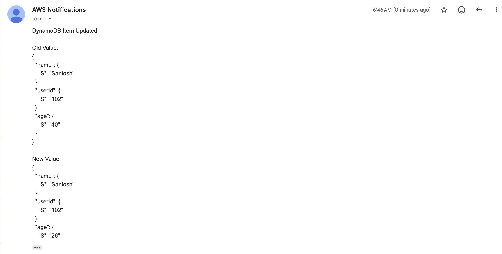

### CloudWatch Logs
- Screenshot 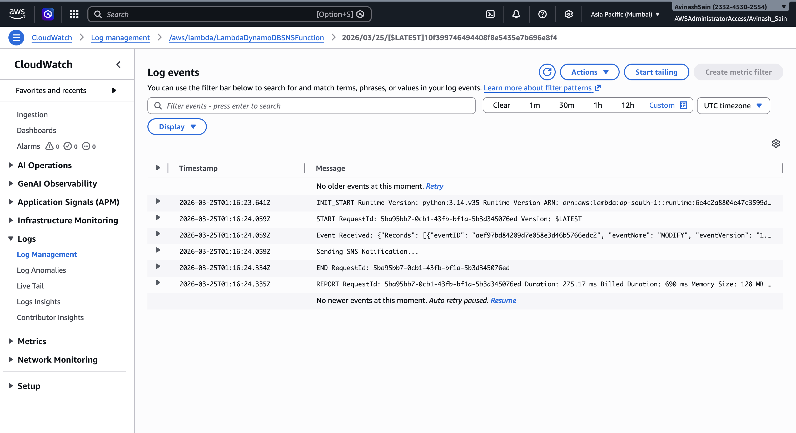

---

## Conclusion
- Successfully captured DynamoDB changes
- Triggered Lambda automatically
- Sent SNS email alert

---

## Notes
- Ensure SNS ARN is correct
- Confirm email subscription
- Check IAM permissions if errors occur

------------------------------------------------------------------------

# Assignment 8: Sentiment Analysis Using AWS Lambda & Amazon Comprehend

---

## Objective
Automatically analyze and categorize the sentiment of user reviews using Amazon Comprehend.

---

## Services Used
- AWS Lambda
- Amazon Comprehend
- IAM
- CloudWatch Logs

---

## Project Structure

assignment-sentiment-analysis/
│
├── README.md
├── lambda_function.py
└── screenshots/
    ├── 1-iam-role.png
    ├── 2-lambda-create.png
    ├── 3-code.png
    ├── 4-test-event.png
    └── 5-cloudwatch-logs.png

---

## Step-by-Step Implementation

### Step 1: Create IAM Role

1. Go to IAM Dashboard
2. Click Roles → Create Role
3. Select AWS Service → Lambda
4. Attach Policy: ComprehendFullAccess, CloudWatchFullAccess
5. Name: Lambda-Comprehend-Role

Screenshot:
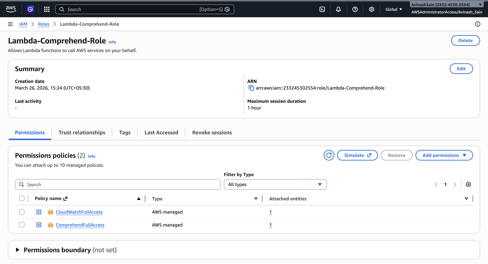

---

### Step 2: Create Lambda Function

1. Go to AWS Lambda
2. Click Create Function
3. Choose:
   - Author from scratch
   - Runtime: Python 3.x
4. Assign IAM Role

Screenshot:
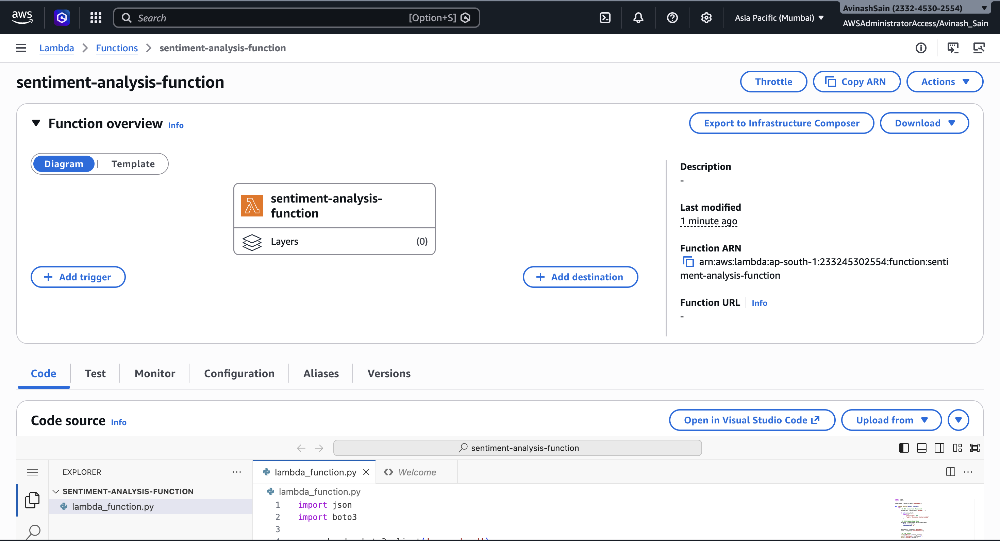

---

### Step 3: Add Lambda Code

```python
import json
import boto3

comprehend = boto3.client('comprehend')

def lambda_handler(event, context):
    try:
        # 1. Get review text from event
        review_text = event.get("review", "")

        if not review_text:
            return {
                "statusCode": 400,
                "body": "No review text provided"
            }

        # 2. Call Amazon Comprehend
        response = comprehend.detect_sentiment(
            Text=review_text,
            LanguageCode='en'
        )

        sentiment = response['Sentiment']
        score = response['SentimentScore']

        # 3. Log result
        print(f"Review: {review_text}")
        print(f"Sentiment: {sentiment}")
        print(f"Scores: {score}")

        # 4. Return response
        return {
            "statusCode": 200,
            "review": review_text,
            "sentiment": sentiment,
            "score": score
        }

    except Exception as e:
        print("Error:", str(e))
        return {
            "statusCode": 500,
            "error": str(e)
        }
```

Screenshot:
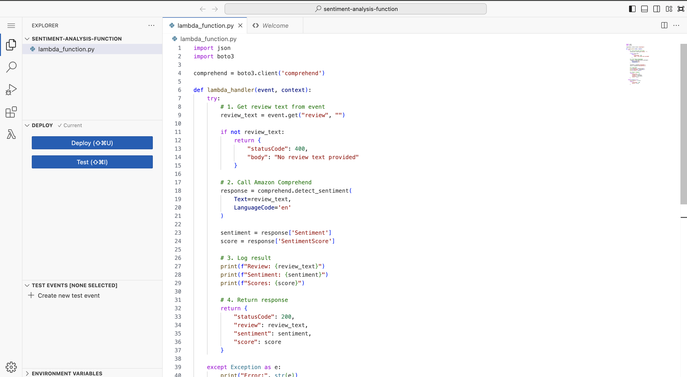

---

### Step 4: Test Lambda Function

#### Sample Input

```json
{
  "review": "Excellent service and very fast delivery!"
}
```

Screenshot:
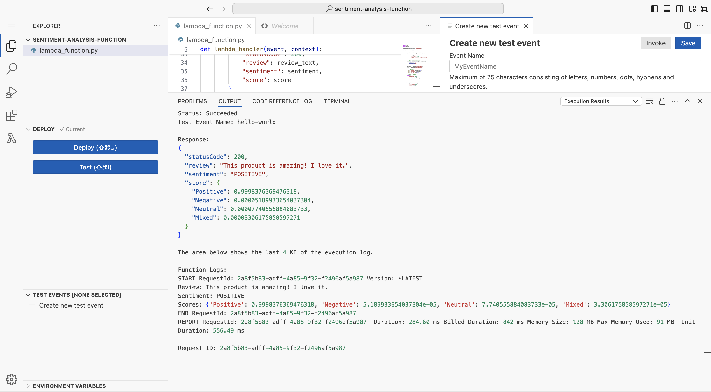

---

### Step 5: Verify Output in CloudWatch

1. Go to Monitor Tab
2. Click View Logs in CloudWatch
3. Check sentiment output

Screenshot:
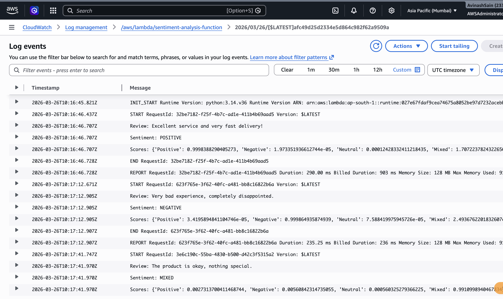

---

## Sample Output

```json
{
  "statusCode": 200,
  "sentiment": "POSITIVE"
}
```

---

## Conclusion
This project demonstrates how to use AWS Lambda with Amazon Comprehend to automatically analyze user review sentiment in real-time.

------------------------------------------------------------------------

# Assignment 9: Archive Old Files from S3 to Glacier Using AWS Lambda and Boto3

---

## Objective
Automate the archival of files older than **6 months** from an S3 bucket to **Glacier storage class** for cost optimization.

---

## Architecture
S3 Bucket → Lambda Function → Glacier Storage Class

---

## Step 1: Create S3 Bucket

1. Go to AWS Management Console
2. Navigate to Amazon S3
3. Click Create Bucket
4. Enter bucket name
5. Upload sample files

Screenshot:  
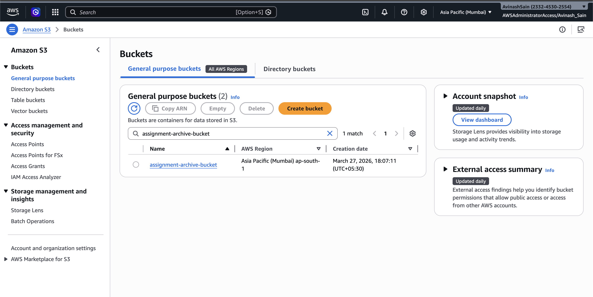

---

## Step 2: Create IAM Role

1. Go to IAM → Roles → Create Role
2. Select Lambda
3. Attach policy: AmazonS3FullAccess, CloudWatchFullAccess
4. Name: LambdaS3GlacierRole

Screenshot:  
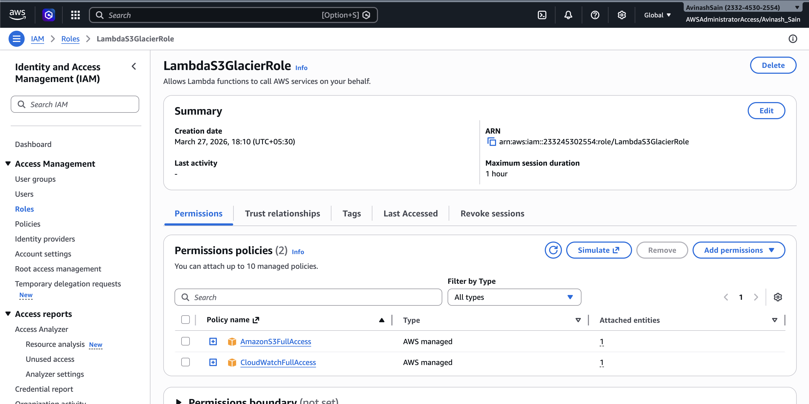

---

## Step 3: Create Lambda Function

1. Go to Lambda → Create Function
2. Runtime: Python 3.x
3. Attach IAM role

Screenshot:  
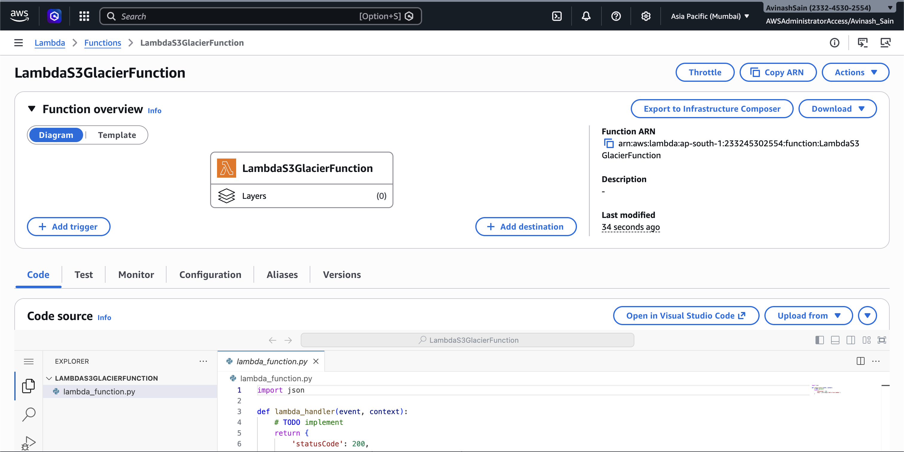

---

## Step 4: Lambda Code

```python
import boto3
from datetime import datetime, timezone, timedelta

s3 = boto3.client('s3')
BUCKET_NAME = 'assignment-archive-bucket'

def lambda_handler(event, context):
    cutoff_date = datetime.now(timezone.utc) - timedelta(days=180)

    response = s3.list_objects_v2(Bucket=BUCKET_NAME)

    if 'Contents' not in response:
        print("No files found.")
        return

    for obj in response['Contents']:
        key = obj['Key']
        last_modified = obj['LastModified']

        if last_modified < cutoff_date:
            print(f"Archiving: {key}")

            s3.copy_object(
                Bucket=BUCKET_NAME,
                Key=key,
                CopySource={'Bucket': BUCKET_NAME, 'Key': key},
                StorageClass='GLACIER'
            )

            print(f"Archived: {key}")
        else:
            print(f"Skipping: {key}")
```

Screenshot:  
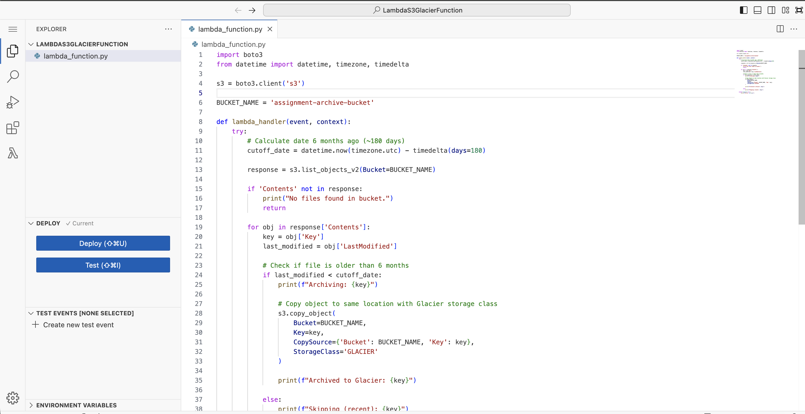

---

## Step 5: (Optional) Add Trigger

Use Amazon EventBridge to schedule Lambda execution (daily/weekly)

Screenshot:  
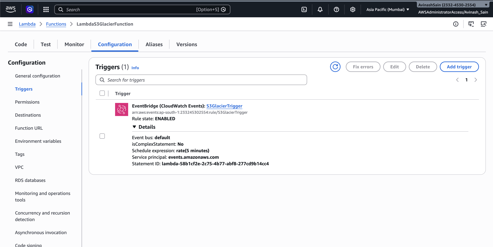

---

## Step 6: Test Lambda

1. Click Test
2. Use empty event: {}

Screenshot:  
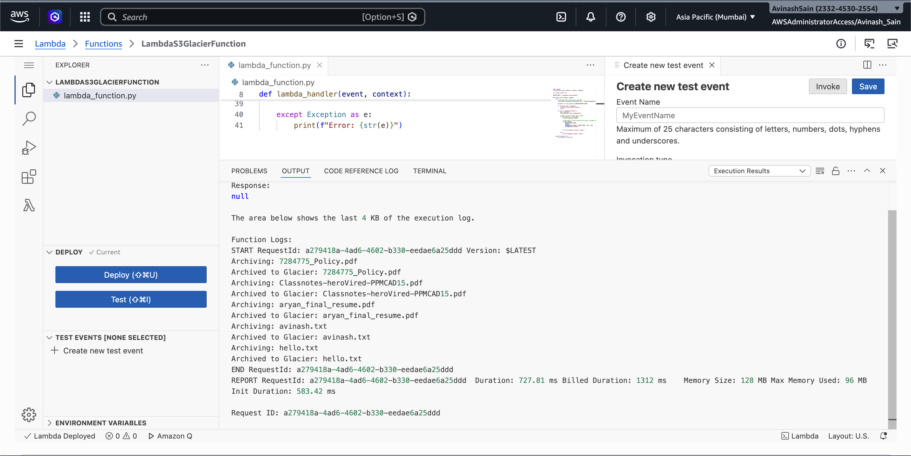

---

## Step 7: Verify in S3

Check storage class → Glacier Flexible Retrieval

Screenshot:  
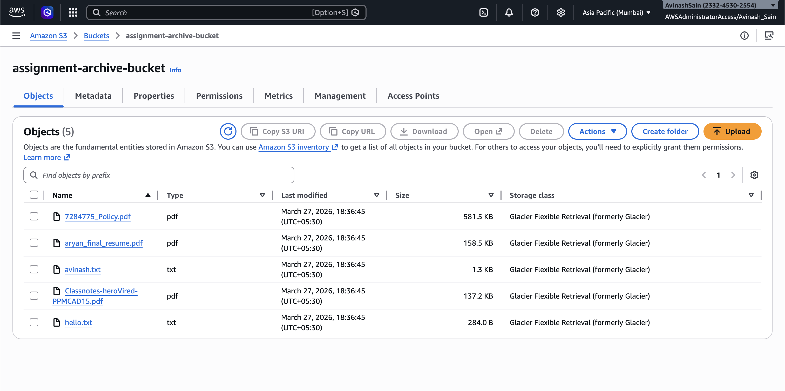

---

## Step 8: CloudWatch Logs

Screenshot:  


---

## Project Structure

```
aws-s3-glacier/
│
├── README.md
├── lambda_function.py
├── screenshots/
│   ├── 1-s3-bucket.png
│   ├── 2-iam-role.png
│   ├── 3-lambda-create.png
│   ├── 4-lambda-code.png
│   ├── 5-lambda-test.png
│   ├── 6-glacier-result.png
│   ├── 7-cloudwatch-logs.png
│   ├── 8-eventbridge.png.png
```

---

## Conclusion

- Successfully archived files to Glacier
- Reduced storage cost
- Learned Lambda + Boto3 integration

---

## Note

- Use 180 days for production
- Lifecycle policies are preferred in real-world scenarios