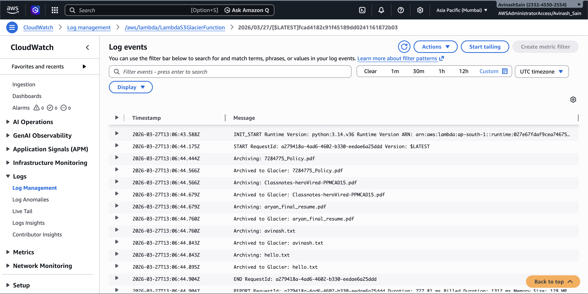

# Assignment 9: Archive Old Files from S3 to Glacier Using AWS Lambda and Boto3

---

## Objective
Automate the archival of files older than **6 months** from an S3 bucket to **Glacier storage class** for cost optimization.

---

## Architecture
S3 Bucket → Lambda Function → Glacier Storage Class

---

## Step 1: Create S3 Bucket

1. Go to AWS Management Console
2. Navigate to Amazon S3
3. Click Create Bucket
4. Enter bucket name
5. Upload sample files

Screenshot:  


---

## Step 2: Create IAM Role

1. Go to IAM → Roles → Create Role
2. Select Lambda
3. Attach policy: AmazonS3FullAccess, CloudWatchFullAccess
4. Name: LambdaS3GlacierRole

Screenshot:  


---

## Step 3: Create Lambda Function

1. Go to Lambda → Create Function
2. Runtime: Python 3.x
3. Attach IAM role

Screenshot:  


---

## Step 4: Lambda Code

```python
import boto3
from datetime import datetime, timezone, timedelta

s3 = boto3.client('s3')
BUCKET_NAME = 'assignment-archive-bucket'

def lambda_handler(event, context):
    cutoff_date = datetime.now(timezone.utc) - timedelta(days=180)

    response = s3.list_objects_v2(Bucket=BUCKET_NAME)

    if 'Contents' not in response:
        print("No files found.")
        return

    for obj in response['Contents']:
        key = obj['Key']
        last_modified = obj['LastModified']

        if last_modified < cutoff_date:
            print(f"Archiving: {key}")

            s3.copy_object(
                Bucket=BUCKET_NAME,
                Key=key,
                CopySource={'Bucket': BUCKET_NAME, 'Key': key},
                StorageClass='GLACIER'
            )

            print(f"Archived: {key}")
        else:
            print(f"Skipping: {key}")
```

Screenshot:  


---

## Step 5: (Optional) Add Trigger

Use Amazon EventBridge to schedule Lambda execution (daily/weekly)

Screenshot:  


---

## Step 6: Test Lambda

1. Click Test
2. Use empty event: {}

Screenshot:  


---

## Step 7: Verify in S3

Check storage class → Glacier Flexible Retrieval

Screenshot:  


---

## Step 8: CloudWatch Logs

Screenshot:  


---

## Project Structure

```
assignment-s3-glacier/
│
├── README.md
├── lambda_function.py
├── screenshots/
│   ├── 1-s3-bucket.png
│   ├── 2-iam-role.png
│   ├── 3-lambda-create.png
│   ├── 4-lambda-code.png
│   ├── 5-lambda-test.png
│   ├── 6-glacier-result.png
│   ├── 7-cloudwatch-logs.png
│   ├── 8-eventbridge.png.png
```

---

## Conclusion

- Successfully archived files to Glacier
- Reduced storage cost
- Learned Lambda + Boto3 integration

---

## Note

- Use 180 days for production
- Lifecycle policies are preferred in real-world scenarios